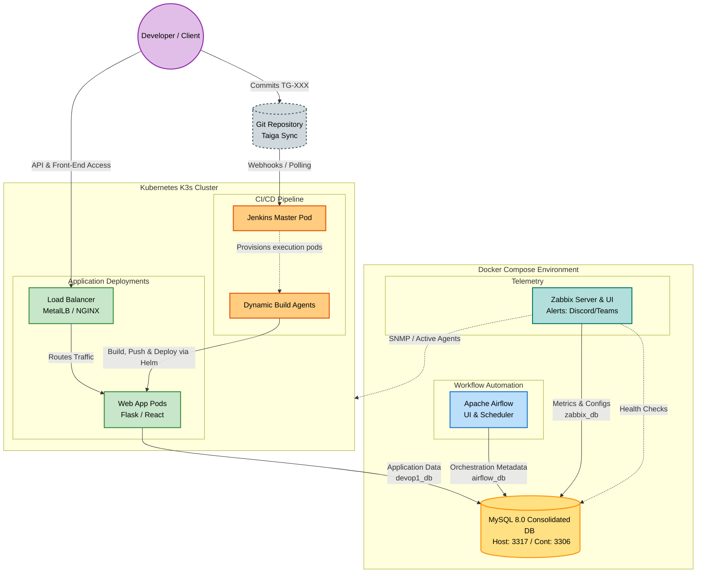

The current version is #ident "@(#)$Format:LocalFoodAI:app.py:%an:%ae:%ad:%cn:%ce:%cd:%H:%D:%N$"

# 🌌 Project Antigravity (DEVOP1)

[](https://docs.docker.com/)
[](https://www.mysql.com/)
[](https://airflow.apache.org/)
[](https://k3s.io/)

Welcome to **Project Antigravity (DEVOP1)**, an enterprise-grade Proof of Concept (PoC) demonstrating self-healing containerization, workflow automation, and unified database architectures across heterogeneous environments.

---

## 📐 System Architecture

The following diagram illustrates the containerized development topology and data flows:



---

## 🛠️ Technology Stack & Matrix

| Layer | Technology | Purpose |
| :--- | :--- | :--- |
| **User Interface** | React / Vanilla HTML & CSS | Frontend for end-user interaction. |
| **Backend API** | Flask (Python 3.11) | Serves endpoints, executes `cron` / `at` system jobs. |
| **Consolidated Database** | MySQL 8.0 | Single engine hosting multiple logical databases (`devop1_db`, `airflow_db`). |
| **Workflow Automation** | Apache Airflow 2.9.1 | Manages execution of DAGs via `LocalExecutor`. |
| **CI/CD Automation** | Jenkins / `antigravity_bot.py` | Idempotent sync of sprints to Taiga boards and build orchestration. |

---

## 💾 Unified Database Architecture (MySQL Consolidation)

To enforce security, optimize resources, and prevent database collisions, this project **consolidates all storage services into a single MySQL 8.0 database engine**, entirely removing PostgreSQL. 

### Logical Databases Hosted:
1. **`devop1_db`**: Stores Flask backend application schemas and transactional data.
2. **`airflow_db`**: Serves as the Apache Airflow workflow engine's metadata repository.

### Host Port Mapping:
* **Host Port:** `3317` (Exposed to avoid conflict with default local MySQL instances).
* **Container Port:** `3306` (Internal container communication is isolated).

### Automated Provisioning (`database/scripts/init.sql`)
When the MySQL stack spins up for the first time, it automatically executes the initialization script:
```sql
CREATE DATABASE IF NOT EXISTS devop1_db;
CREATE DATABASE IF NOT EXISTS airflow_db;

CREATE USER IF NOT EXISTS 'dev_user'@'%' IDENTIFIED BY 'your_db_password_here';
GRANT ALL PRIVILEGES ON devop1_db.* TO 'dev_user'@'%';

CREATE USER IF NOT EXISTS 'airflow'@'%' IDENTIFIED BY 'airflow';
GRANT ALL PRIVILEGES ON airflow_db.* TO 'airflow'@'%';
```

---

## 🔀 Git Workflow Standards & Cheat Sheet

We enforce strict Agile tracking and repository standards. **No changes to project files can be made without creating a task in Taiga first.** Commit messages must reference the Taiga ID (e.g., `TG-101`) to maintain clear audit logs.

### 📚 Commit Format Specification
```text
TG-<TaskID>: <Brief description in active voice>

- Detailed bullet point explaining why and what was changed
- Includes any testing verification executed
```
*Example:* `TG-105: Consolidate PostgreSQL to MySQL for Airflow metadata`

For all the commit a task in taiga must be associated. If the task does not exists created and add the task to a user story and a sprints.

### ⚡ Git Cheat Sheet

* **Create & Switch to a Feature Branch:**
  ```bash
  git checkout -b feature/TG-<TaskID>-description
  ```
* **Verify Current Workspace Status:**
  ```bash
  git status
  ```
* **Stage Modified & Untracked Files:**
  ```bash
  git add <filename>
  ```
* **Commit with Dynamic Formatting Rules:**
  ```bash
  git commit -m "TG-123: Implement database consolidation"
  ```
* **Push Branch to Origin:**
  ```bash
  git push -u origin feature/TG-<TaskID>-description
  ```

---

## ⚙️ Dynamic Git Filters ($Format$)

This repository utilizes advanced smudge/clean Git filters to dynamically inject repository metadata (author name, email, dates, commit hashes) into source code headers during checkouts, while storing them in a pristine "clean" state in Git to prevent merge conflicts.


### 🚀 Filter Setup Instructions

Run the setup script corresponding to your developer environment to register the filters in `.git/config`:

* **Windows Native (PowerShell/CMD):**
  ```cmd
  local_tools\setup_filters.bat
  ```
* **Unix / WSL / macOS:**
  ```bash
  chmod +x local_tools/setup_filters.sh
  ./local_tools/setup_filters.sh
  ```

These scripts register a **fully portable relative filter driver** that executes regardless of where your project repository is cloned:
```bash
git config filter.ident-dynamic.clean "python local_tools/git-ident-filter.py clean"
git config filter.ident-dynamic.smudge "python local_tools/git-ident-filter.py smudge %f"
```

---

## 🐳 Quickstart: Docker Compose Local Environment

1. **Configure the Local Environment (`.env`):**
   Copy the example template file to create your local `.env`:
   ```bash
   cp .env.example .env
   ```
   Modify the `.env` parameters (e.g. database credentials, monitoring webhooks, ports) as needed.
2. **Launch the Container Stack:**
   ```bash
   docker compose up -d
   ```
3. **Verify Service Health:**
   ```bash
   docker compose ps
   ```
4. **Access Applications:**
   * **Web Backend API:** `http://localhost:5000`
   * **Apache Airflow Dashboard:** `http://localhost:8080` (Credentials: `admin`/`admin`)
   * **MySQL Server:** Host `127.0.0.1`, Port `3317`, User `dev_user` / Pass `your_db_password_here`

---

## 🧪 Development Guidelines & Testing Policy

1. **Prerequisite Validation:** Every shell script and service config must programmatically verify that required environment variables exist and are not empty before proceeding with execution.
2. **Post-Task Verification:** A task cannot be resolved without a corresponding test validating its success. After executing database updates, connectivity checks must be run.
3. **WSL Integration:** WSL distributions (such as `B1AI_DEVOP1_LanFr144`) are linked directly to the project via `/mnt/c/...` or the home symlink (`~/devop1`), allowing easy CLI administration and verification under a Unix runtime.


## 🌟 Standard Repository & Skill Guidelines

This project strictly adheres to the developer standards defined across our organization's workspace. Every contribution must respect the following practices:

### 1. Git Commit & Pipeline Governance
* **Taiga Hook Validation:** Every commit message must start with a valid Taiga task/story ID tag (e.g., `TG-123`, `US#123`, or `[#123]`). A local git hook (`local_tools/commit-msg`) is configured to enforce this format.
* **Pipeline Progression:** Code must progress strictly through the branches: `development` -> `test` -> `production`.
* **Segregation of Duties:** Authors promoting/merging code must not be the sole author without secondary gate review (warnings will be generated if promoting directly without review gates).
## 1. Mandatory File Identification Header (CRITICAL)
* **Header Tag Requirement:** Every source code, scripting, config, or text file (including ignored scratch files) must include the exact identity format at the top of the file:
```text
i d e n t   " @ ( # ) $ F o r m a t : { p r o j e c t _ n a m e } : { f i l e _ n a m e } : % a n : % a e : % a d : % c n : % c e : % c d : % H : % D : % N $ "
```
*Note: In the template above, the character sequence has been intentionally formatted with spaces between each character (representing the `sed` transformation `s/./& /g`). This prevents Git's clean/smudge filters from matching, interpreting, and modifying this rule documentation file itself.*
  For tracked files, the Git smudge filter (`ident-dynamic`) will automatically expand the placeholder variables with real Git commit and author/committer data during checkouts. Untracked or ignored scratch files must still physically carry this header comment as a repository consistency requirement.
  The comment syntax must match the file's language (e.g., `#` for Python/Shell/YAML/Markdown/Dockerfiles, `--` for SQL, `::` for Batch). For tracked files, the git smudge filter expands this dynamically. Ignore-listed/scratch files must carry the comment statically for structure.

  To initialize a new file, place the clean version at the top of your file (legible examples are listed below in spaced-out format to prevent active smudge filter matching):
- For Python/Shell files:
  `# i d e n t   " @ ( # ) $ F o r m a t : G i t  p r o j e c t   n a m e : f i l e n a m e : % a n : % a e : % a d : % c n : % c e : % c d : % H : % D : % N $ "`
- For SQL files:
  `- - i d e n t   " @ ( # ) $ F o r m a t : G i t  p r o j e c t   n a m e : f i l e n a m e : % a n : % a e : % a d : % c n : % c e : % c d : % H : % D : % N $ "`
- For Batch files:
  `: : i d e n t   " @ ( # ) $ F o r m a t : G i t  p r o j e c t   n a m e : f i l e n a m e : % a n : % a e : % a d : % c n : % c e : % c d : % H : % D : % N $ "`
- For Markdown/YAML/Dockerfiles/XML:
  `# i d e n t   " @ ( # ) $ F o r m a t : G i t  p r o j e c t   n a m e : f i l e n a m e : % a n : % a e : % a d : % c n : % c e : % c d : % H : % D : % N $ "`
* **Line Endings:** All files must use **LF** (Line Feed) line endings. The only exception is Windows batch scripts (`*.bat`), which must use **CRLF**.
* **Wiki Documentation Cadence:** Progress files under `documentation/` must be generated and synced to the Taiga Wiki board (`python ci-cd/antigravity_bot.py --wiki documentation/`) according to the schedule:
  * Daily logs (`yyyymmdd_daily.md`) must be compiled and synced daily.
  * Plan logs (`yyyymmdd_plan.md`) must be compiled and synced once every 2 days (excluding Sundays).
  * Review logs (`yyyymmdd_revue.md`) must be compiled and synced once every 2 days (excluding Sundays).
* **Scratch Directory Management:** Files inside `./scratch` are never deleted. Instead, use the archiving utility `python local_tools/archive_scratch.py` to move them to `%USERPROFILE%\keep`. If a file already exists in the destination, a 3-digit version code is appended using a semicolon (e.g., `test_filter.py;001`, `test_filter.py;002`).

### 2. Code Review & Mentorship Policy
* **Mentorship Perspective:** Senior engineers and peer reviewers adopt a constructive, instructional persona when providing code feedback.
* **Review Checklist:**
  * **Correctness:** Verify the implementation solves the intended requirements.
  * **Edge cases:** Handle null inputs, boundary conditions, and error states defensively.
  * **Style:** Adhere strictly to project conventions.
  * **Performance:** Resolve nested loops, inefficient data structures, or other potential bottlenecks.
* **Feedback Quality:** Feedback must be specific, explaining the *why* rather than just the *what*, and offering clean alternative implementations where possible.

### 3. Refactoring & Architecture Standards
* **DRY Principle:** Identify duplicated blocks and extract them into reusable utilities, helper functions, or libraries.
* **Complexity Reduction:** Deconstruct long, monolithic functions into small, single-purpose helper functions.
* **Micro-Files Strategy:** Prefer small, single-purpose files over monolithic structures. This ensures cleaner change tracking and simpler unit testing.
* **Behavioral Safety:** Refactored code must maintain identical external APIs and behavior without side-effects.

### 4. Database & SQL Optimization Standards (MySQL)
* **Performance & Locks:** Prevent row locking issues and deadlocks. Always utilize database analysis tools (like `EXPLAIN`) for performance auditing.
* **Security & Access Control:**
  * **No Hardcoded Credentials:** Application scripts must never embed plain usernames or passwords.
  * **Restricted Access:** Access database objects via proxy users or restricted views owned by dedicated schemas.
  * **Bind Variables:** All parameterized inputs must use bind variables. Dynamic query string concatenation is strictly forbidden.
  * **Grants & Synonyms:** DDL/DML scripts must include required `GRANT` statements and `SYNONYM` configurations.
* **Transaction Management:** Auto-commit must be disabled. Explicitly control transaction scope via `COMMIT` and `ROLLBACK` blocks.
* **Syntax Standards:** Object and column names must be double-quoted (`"`) or back-quoted (`` ` ``) to prevent collision with reserved keywords. Avoid using keywords reserved in Oracle or standard SQL.

### 5. Documentation Synchronization
* **Continuous Synchronization:** Documentation, inline comments, and README instructions must be updated concurrently with any code change.
* **Architectural Impacts:** Significant system design updates must be traced and documented across the entire codebase.
* **Onboarding On-demand:** Documentation is authored assuming the reader is a new teammate, requiring maximum clarity and completeness.

### 6. Test-Driven Development (TDD) Policy
* **Isolation vs Integration:** Write unit tests for individual functions and integration tests for complete workflows.
* **Robust Mocks:** Mock external databases, API calls, and environment parameters using robust testing frameworks.
* **Coverage:** Strive for maximum logical coverage, specifically targeting newly modified lines of code.

---

## 🗃️ 9. Project Operations & Setup Manuals

* **[Deployment & Operations Manual](file:///c:/Users/your_windows_user_here/Documents/DEVOP1/antigravity/DEVOP1/docs/OPERATIONS_MANUAL.md):** The primary operational document detailing dynamic port offsetting, local setup, database backup/restores, and Kubernetes instructions.
* **[Gemini Skills Setup Guide](file:///c:/Users/your_windows_user_here/Documents/DEVOP1/antigravity/DEVOP1/docs/GEMINI_SKILLS_SETUP.md):** Explains how to place and configure Gemini agent skills to enforce development standards.
* **[Taiga Project State Export](file:///c:/Users/your_windows_user_here/Documents/DEVOP1/antigravity/DEVOP1/docs/taiga_export.json):** The JSON database snapshot showing the fully closed state of the Agile boards, stories, and tasks.

# DevOps Course Knowledge Base

This repository contains the official course materials, instructions, and rules for the B1AI DEVOP1 curriculum. 

## 10. Instructions for AI Assistants (Antigravity)
1. **Primary Source:** Always search the `./cours/` directory first for specific software versions, syntax, and lab instructions.
2. **Solutions:** If the user asks for the answer to a lab exercise or comprehension question, refer to `./cours/DevOps_Cookbook_Solutions.md`.
3. **Sequential Logic:** The course progresses from Unit 01 to Unit 39. Do not provide advanced solutions from later units if the user is currently working on an earlier unit.

## 11. Course Index
All module files are located in the `./cours/` directory:

* [Unit 01 - Introduction to Developer Operations](./cours/Unit_01.md)
* [Unit 02 - Introduction to Docker](./cours/Unit_02.md)
* [Unit 02a - Installing Docker Engine on Ubuntu Server](./cours/Unit_02a.md)
* [Unit 02b - WSL and Visual Studio](./cours/Unit_02b.md)
* [Unit 03 - Experiencing Docker with a ready to use image](./cours/Unit_03.md)
* [Unit 04 - Docker Commands](./cours/Unit_04.md)
* [Unit 05 - Volumes](./cours/Unit_05.md)
* [Unit 06 - Installing and running n8n with Docker](./cours/Unit_06.md)
* [Unit 07 - Container Management](./cours/Unit_07.md)
* [Unit 08 - Advanced Docker Concepts](./cours/Unit_08.md)
* [Unit 09 - Container Management TeamSpeak](./cours/Unit_09.md)
* [Unit 10 - Application of the Learned Concepts](./cours/Unit_10.md)
* [Unit 11 - Docker Compose as an Alternative to Docker Run](./cours/Unit_11.md)
* [Unit 12 - Apache and PHP](./cours/Unit_12.md)
* [Unit 13 - NGINX and PHP-FPM](./cours/Unit_13.md)
* [Unit 14 - Dockerfile](./cours/Unit_14.md)
* [Unit 15 - Bind Mounts](./cours/Unit_15.md)
* [Unit 16 - Dockerfile and Docker Compose](./cours/Unit_16.md)
* [Unit 17 - Multi-Container Applications](./cours/Unit_17.md)
* [Unit 18 - Git](./cours/Unit_18.md)
* [Unit 19 - Working with GitHub in VS Code](./cours/Unit_19.md)
* [Unit 20 - Branches](./cours/Unit_20.md)
* [Unit 21 - Working with Branches](./cours/Unit_21.md)
* [Unit 22 - Tags](./cours/Unit_22.md)
* [Unit 23 - Checkout](./cours/Unit_23.md)
* [Unit 24 - Commit](./cours/Unit_24.md)
* [Unit 25 - Merge](./cours/Unit_25.md)
* [Unit 26 - Push](./cours/Unit_26.md)
* [Unit 27 - Git and Github](./cours/Unit_27.md)
* [Unit 28 - Basic Git Workflow with GitLab](./cours/Unit_28.md)
* [Unit 29 - Management of Code Base and Version](./cours/Unit_29.md)
* [Unit 30 - SNMP Introduction](./cours/Unit_30.md)
* [Unit 31 - Zabbix](./cours/Unit_31.md)
* [Unit 32 - Zabbix Dashboard](./cours/Unit_32.md)
* [Unit 33 - Zabbix-Trigger and Alerts](./cours/Unit_33.md)
* [Unit 34 - Uptime Kuma and Docker Compose Installation](./cours/Unit_34.md)
* [Unit 35 - Zabbix Alerts and Microsoft Teams](./cours/Unit_35.md)
* [Unit 36 - Pipelines](./cours/Unit_36.md)
* [Unit 37 - Orchestration](./cours/Unit_37.md)
* [Unit 38 - Static Orchestration](./cours/Unit_38.md)
* [Unit 39 - Hands-on Jenkins](./cours/Unit_39.md)
