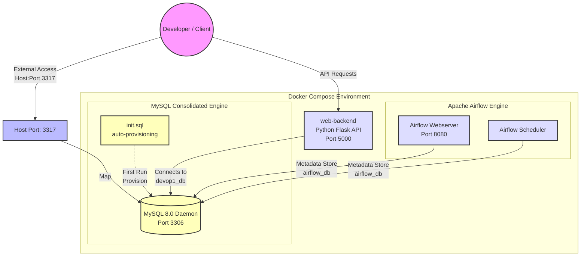

# ident @(#)$Format:LocalFoodAI:app.py:%an:%ae:%ad:%cn:%ce:%cd:%H:%D:%N$

# 🌌 Project Antigravity (DEVOP1)

[](https://docs.docker.com/)
[](https://www.mysql.com/)
[](https://airflow.apache.org/)
[](https://k3s.io/)

Welcome to **Project Antigravity (DEVOP1)**, an enterprise-grade Proof of Concept (PoC) demonstrating self-healing containerization, workflow automation, and unified database architectures across heterogeneous environments.

---

## 📐 System Architecture

The following diagram illustrates the containerized development topology and data flows:



---

## 🛠️ Technology Stack & Matrix

| Layer | Technology | Purpose |
| :--- | :--- | :--- |
| **User Interface** | React / Vanilla HTML & CSS | Frontend for end-user interaction. |
| **Backend API** | Flask (Python 3.11) | Serves endpoints, executes `cron` / `at` system jobs. |
| **Consolidated Database** | MySQL 8.0 | Single engine hosting multiple logical databases (`devop1_db`, `airflow_db`). |
| **Workflow Automation** | Apache Airflow 2.9.1 | Manages execution of DAGs via `LocalExecutor`. |
| **CI/CD Automation** | Jenkins / `antigravity_bot.py` | Idempotent sync of sprints to Taiga boards and build orchestration. |

---

## 💾 Unified Database Architecture (MySQL Consolidation)

To enforce security, optimize resources, and prevent database collisions, this project **consolidates all storage services into a single MySQL 8.0 database engine**, entirely removing PostgreSQL. 

### Logical Databases Hosted:
1. **`devop1_db`**: Stores Flask backend application schemas and transactional data.
2. **`airflow_db`**: Serves as the Apache Airflow workflow engine's metadata repository.

### Host Port Mapping:
* **Host Port:** `3317` (Exposed to avoid conflict with default local MySQL instances).
* **Container Port:** `3306` (Internal container communication is isolated).

### Automated Provisioning (`database/scripts/init.sql`)
When the MySQL stack spins up for the first time, it automatically executes the initialization script:
```sql
CREATE DATABASE IF NOT EXISTS devop1_db;
CREATE DATABASE IF NOT EXISTS airflow_db;

CREATE USER IF NOT EXISTS 'dev_user'@'%' IDENTIFIED BY 'your_db_password_here';
GRANT ALL PRIVILEGES ON devop1_db.* TO 'dev_user'@'%';

CREATE USER IF NOT EXISTS 'airflow'@'%' IDENTIFIED BY 'airflow';
GRANT ALL PRIVILEGES ON airflow_db.* TO 'airflow'@'%';
```

---

## 🔀 Git Workflow Standards & Cheat Sheet

We enforce strict Agile tracking and repository standards. **No changes to project files can be made without creating a task in Taiga first.** Commit messages must reference the Taiga ID (e.g., `TG-101`) to maintain clear audit logs.

### 📚 Commit Format Specification
```text
TG-<TaskID>: <Brief description in active voice>

- Detailed bullet point explaining why and what was changed
- Includes any testing verification executed
```
*Example:* `TG-105: Consolidate PostgreSQL to MySQL for Airflow metadata`

### ⚡ Git Cheat Sheet

* **Create & Switch to a Feature Branch:**
  ```bash
  git checkout -b feature/TG-<TaskID>-description
  ```
* **Verify Current Workspace Status:**
  ```bash
  git status
  ```
* **Stage Modified & Untracked Files:**
  ```bash
  git add <filename>
  ```
* **Commit with Dynamic Formatting Rules:**
  ```bash
  git commit -m "TG-123: Implement database consolidation"
  ```
* **Push Branch to Origin:**
  ```bash
  git push -u origin feature/TG-<TaskID>-description
  ```

---

## ⚙️ Dynamic Git Filters ($Format$)

This repository utilizes advanced smudge/clean Git filters to dynamically inject repository metadata (author name, email, dates, commit hashes) into source code headers during checkouts, while storing them in a pristine "clean" state in Git to prevent merge conflicts.

### 🚀 Filter Setup Instructions

Run the setup script corresponding to your developer environment to register the filters in `.git/config`:

* **Windows Native (PowerShell/CMD):**
  ```cmd
  local_tools\setup_filters.bat
  ```
* **Unix / WSL / macOS:**
  ```bash
  chmod +x local_tools/setup_filters.sh
  ./local_tools/setup_filters.sh
  ```

These scripts register a **fully portable relative filter driver** that executes regardless of where your project repository is cloned:
```bash
git config filter.ident-dynamic.clean "python local_tools/git-ident-filter.py clean"
git config filter.ident-dynamic.smudge "python local_tools/git-ident-filter.py smudge %f"
```

---

## 🐳 Quickstart: Docker Compose Local Environment

1. **Verify or Configure the Local Environment (`.env`):**
   Ensure `.env` contains the required credentials and ports.
2. **Launch the Container Stack:**
   ```bash
   docker compose up -d
   ```
3. **Verify Service Health:**
   ```bash
   docker compose ps
   ```
4. **Access Applications:**
   * **Web Backend API:** `http://localhost:5000`
   * **Apache Airflow Dashboard:** `http://localhost:8080` (Credentials: `admin`/`admin`)
   * **MySQL Server:** Host `127.0.0.1`, Port `3317`, User `dev_user` / Pass `your_db_password_here`

---

## 🧪 Development Guidelines & Testing Policy

1. **Prerequisite Validation:** Every shell script and service config must programmatically verify that required environment variables exist and are not empty before proceeding with execution.
2. **Post-Task Verification:** A task cannot be resolved without a corresponding test validating its success. After executing database updates, connectivity checks must be run.
3. **WSL Integration:** WSL distributions (such as `B1AI_DEVOP1_LanFr144`) are linked directly to the project via `/mnt/c/...` or the home symlink (`~/devop1`), allowing easy CLI administration and verification under a Unix runtime.
