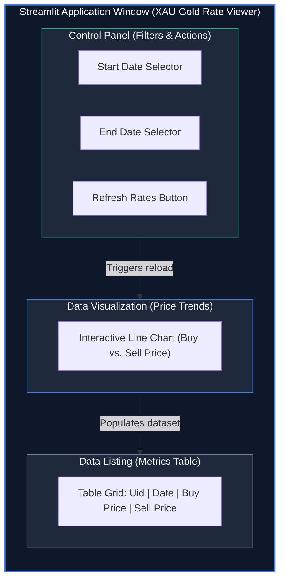

#ident "@(#)$Format:LocalFoodAI:app.py:%an:%ae:%ad:%cn:%ce:%cd:%H:%D:%N$"
# Streamlit Dashboard Wireframes

This document details the user interface layout for the Streamlit data viewer using a Mermaid structural graph.

