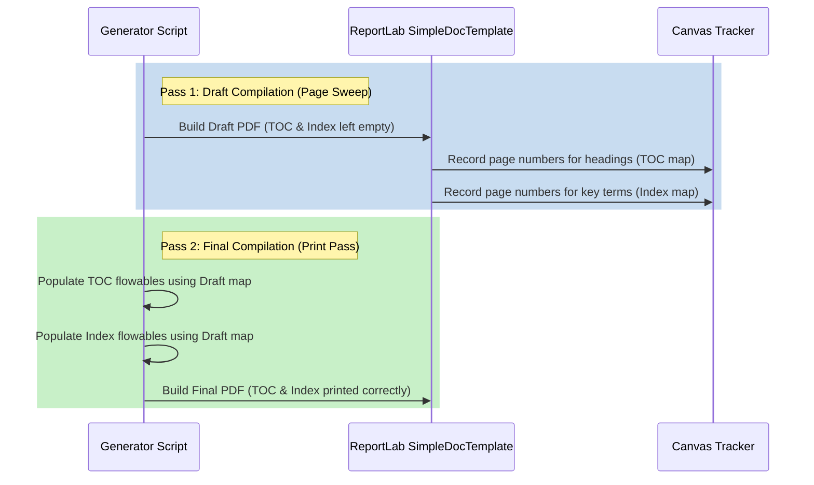

The current version is #ident "@(#)$Format:LocalFoodAI:app.py:%an:%ae:%ad:%cn:%ce:%cd:%H:%D:%N$"

# ReportLab PDF Generation Engine Guide

This document describes the design, pipeline architecture, and implementation guidelines for compiling Markdown files into print-ready, high-fidelity PDFs using Python (specifically Python's `reportlab` library). It includes cover page generation, printed tables of contents, automated reference tables, page-search indices, and catalog portal rendering.

---

## 📐 Two-Pass Compilation Pipeline

To determine the exact page numbers of headings (for the Table of Contents) and target keyword occurrences (for the Index), the script must compile the document in two passes:



---

## 🎨 Layout and Style Guidelines

### 1. Cover Page Layout
A cover page should serve as a clean visual entry point. It must omit headers, footers, and page numbers:
- **Title**: Large, bold font (24-32pt), centered vertically.
- **Metadata**: Course/project category (e.g., `B1AI`), Author Name (`Roni Fernandes Dias / François LANGE`), and compilation date.
- **Page Break**: Insert a `PageBreak()` immediately following the metadata flowables.

### 2. Blank Page Insertion
Following the cover page, insert a blank page to separate the cover from the table of contents.
- Use a dummy flowable or a blank canvas callback on Page Index 1.
- Skip headers and footers on both the Cover Page and the Blank Page.

---

## 📚 Dynamic Table of Contents (TOC)

During the **Draft Pass**, a custom canvas callback records the page number when a heading is rendered:

```python
class TOCPageTracker:
    def __init__(self):
        self.header_page_map = {}

    def record_heading(self, heading_text, current_page):
        # Store page location for heading text
        if heading_text not in self.header_page_map:
            self.header_page_map[heading_text] = current_page
```

During the **Final Pass**, the script builds the TOC flowables:

```python
def create_toc_section(tracker, styles):
    story = [Paragraph("Table of Contents", styles['Heading1']), Spacer(1, 15)]
    for heading, page_num in tracker.header_page_map.items():
        # Render a dot-leader layout (Heading Title ......... Page X)
        toc_line = f"{heading} {'.' * (60 - len(heading))} {page_num}"
        story.append(Paragraph(toc_line, styles['Normal']))
    story.append(PageBreak())
    return story
```

---

## 📖 Automated Page-Search Index

To build a printed document index:
1.  **Draft Sweep**: Scan the text blocks of the draft document page-by-page.
2.  **Match Key Terms**: Search for occurrences of target terms (e.g. `MySQL`, `Docker`, `Ollama`).
3.  **Map Coordinates**: Map each term to a list of page numbers.
4.  **Final Print**: Print the index alphabetically at the end of the document.

```python
# Generic Index generator dictionary mapping
index_terms = ["MySQL", "Docker", "Ollama", "Telemetry", "RAG", "SearXNG"]
page_occurrence_map = {term: set() for term in index_terms}

# During draft text parsing:
for page_index, page_text in draft_pages:
    for term in index_terms:
        if term.lower() in page_text.lower():
            page_occurrence_map[term].add(page_index)
```

---

## 🔗 Automatic References & Bibliography

Construct a table of references dynamically before the index by scanning markdown URLs:
- Parse all Markdown URLs (`[Link Text](http://url)`) in the source text.
- Build a bibliography listing the resource descriptions and their target URLs.
- Render them as a clean ReportLab table flowable at the end of the document.

---

## 🕸️ Responsive Documentation Portal (`index.html`)

For a professional delivery, package compiled PDFs inside an HTML portal dashboard:
- **Clean Styling**: Curated grid colors, sans-serif typography, hover-animated cards.
- **Direct Access**: Individual cards for each document category containing summaries and direct view/download links.

Example design elements:
```html
<div class="grid-container">
  <div class="doc-card">
    <h3>Installation Manual</h3>
    <p>Step-by-step instructions to configure the local services stack in WSL2.</p>
    <a href="docs/Installation_Guide.pdf" class="btn">Open PDF</a>
  </div>
</div>
```
